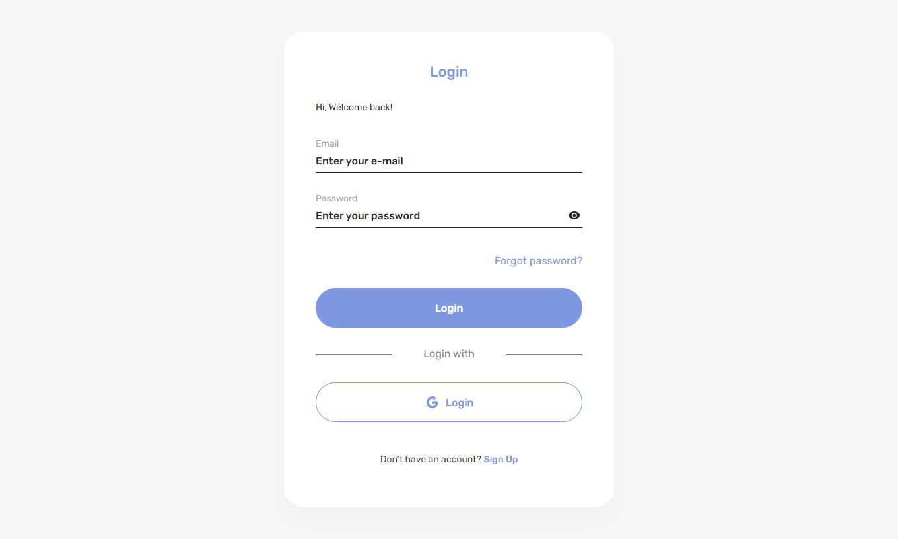
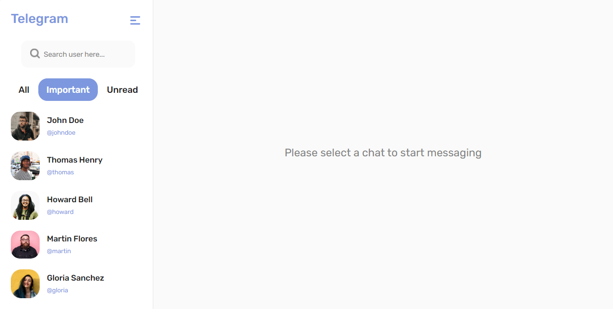
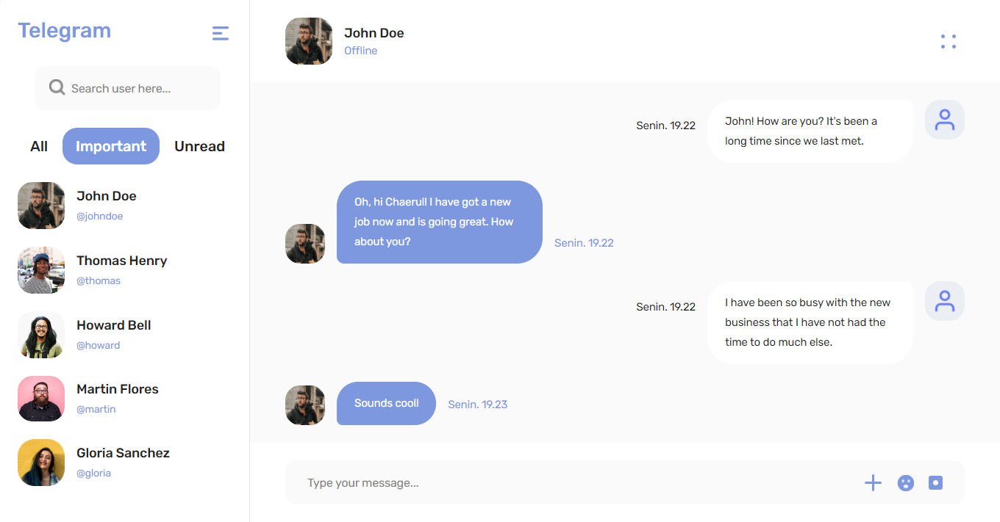
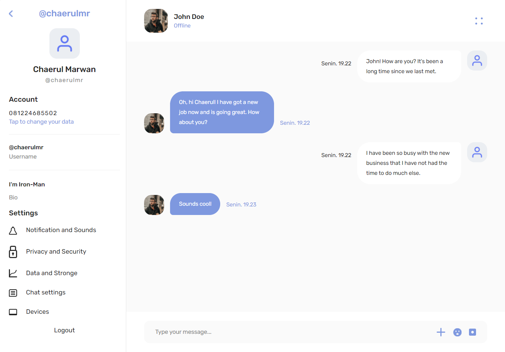
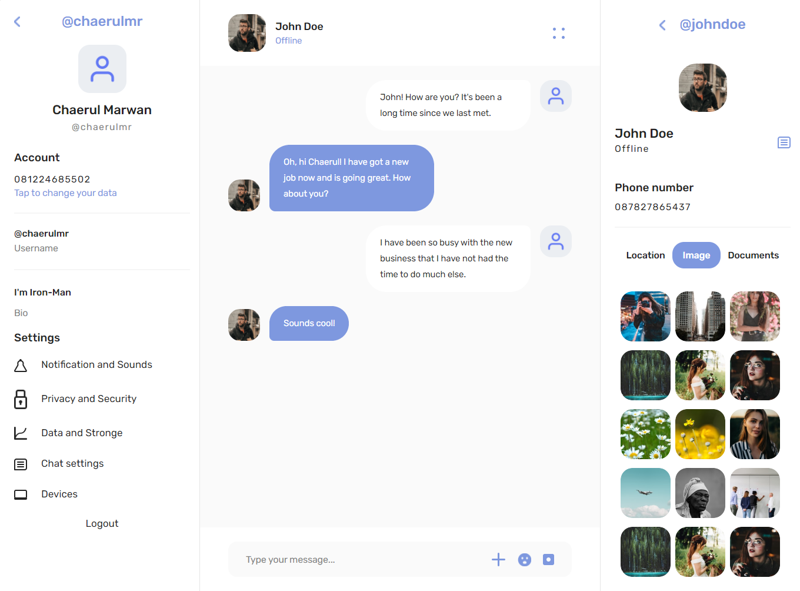

<h1 align="center">Telegram</h1>
<p align="center">
  <a href="https://chatting-telegram.netlify.app/" target="_blank"></a>
</p>

## Table of Contents

- [Introduction](#introduction)
- [Features](#features)
- [Built With](#built-with)
- [Prerequisites](#prerequisites)
- [Endpoint](#endpoint)
- [Installation](#installation)
- [Related Project](#related-project)

## Introduction

The Telegram app is a chat application that allows users to send messages to other users in realtime. This application was built for a week with the main tools namely express, mysql, react, and socket.io.

## Features

- Authentication

- Reset password

- Realtime chatting using socket.io

- Realtime online/offline status using socket.io

- Realtime notification using socket.io

- Upload image profile

- Change profile

## Built With

- [ReactJs](https://reactjs.org/)
- [Redux](https://redux.js.org/)
- [Bootstrap](https://getbootstrap.com/)
- [Socket.io](https://socket.io/)

## Installation

1. Open your terminal or command prompt. Then, clone the repo.

```
$ git clone https://github.com/chaerulmarwan20/telegram-app.git
```

2. Open this project.

```
$ cd telegram-app
$ npm install
```

3. Create environment variable.

```
$ cp .env.example .env
```

4. Run this application.

```
$ npm start
```

## Screenshots

<p align="center">
  <span>
       
       
       
       
       
  </span>
</p>

## Related Project

- :white_check_mark: [`Backend Telegram`](https://github.com/chaerulmarwan20/telegram-app-backend)
- :rocket: [`Production`](https://chatting-telegram.netlify.app/)
